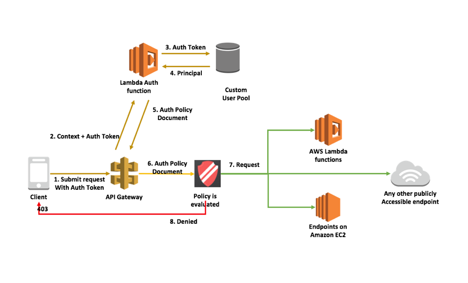

# serverless-tour

学习了解了一些新东西，记录下来。如有错误，不妨指出 请轻喷～～～

## 无服务架构在Python中应用场景实现。

### 使用JWT和AWS ApiGateway自定义授权程序的授权示例。

python 3.6 环境下运行开发。

涉及到使用 4个 aws lambda function 授权到鉴权与刷新token 操作

jwt_sing_function(登录授权函数)

jwt_verify_function(授权校验函数)

jwt_gateway_function(统一分发函数)

jwt_refreshing_function(刷新授权函数)

##### 解决问题：
    
   现有系统内网服务供外部使用，负载网关，追求稳定并且通用，那么API Gateway 可靠性不二之选。
   
   API Gateway + 自定义授权 + Vpc Link + NBL负载均衡可实现对外开放部分接口需求。
   
   譬如外部子系统需要使用到部分内部接口时，Api Gateway便可大展身手。

##### 参考资料：

   [AWS API Gateway Lambda 授权方](https://docs.amazonaws.cn/apigateway/latest/developerguide/apigateway-use-lambda-authorizer.html)
    ，
   [Serverless-Auth](https://github.com/yosriady/serverless-auth)
    
    
##### 遇到问题：

   获取token解析后，如果将当前用户信息带到执行lambda函数执行上下文中。
   
   google查阅过多基于node.js 譬如[Accessing principalid or claim from authorizer function](https://forum.serverless.com/t/solved-accessing-principalid-or-claim-from-authorizer-function/1648)
    
   由于node.js-8 加入身份信息等查询操作，登录信息，lambda冷启动，初次运行将达接近10s
   使我不得切换为Python环境下开发。
   
   python带给我快乐的同时也带来了不少麻烦，
   
   1， 不会python，现学现用，python牛逼！！
   
   2， 先是环境问题， windows下开发下载的package并不适用于aws lambda python 环境
   
   [Import Error from cyptography.hazmat.bindings._constant_time import lib 依赖包问题](https://stackoverflow.com/questions/38963857/import-error-from-cyptography-hazmat-bindings-constant-time-import-lib)
   
   3， api gateway 添加自定义授权方之后，使用方携带token访问，授权认证之后返回Arn授权与拦截调用接口的权限，
     同时我的业务场景不止是接口的授权，还涉及到权限控制，那么就务必将授权后的身份信息带到接口执行方，在此项目
     jwt_gateway_function为执行方（此初可以是vpc内环境接口调用，也可以是外网服务调用，称为分发函数吧。）
     那么这个函数也要知道来源身份信息。
      
   [使用自定义授权程序上下文与Lambda代理集成](https://medium.com/tomincode/using-custom-authorizer-context-with-lambda-proxy-integration-1f6eeabb5e4f)
      

##### 整体构架：

   

 

  